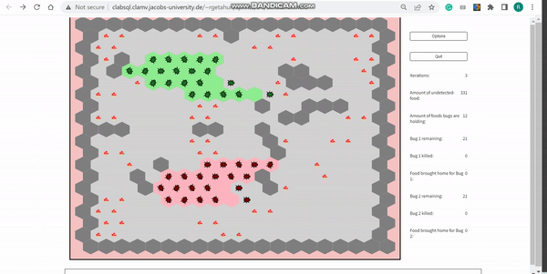
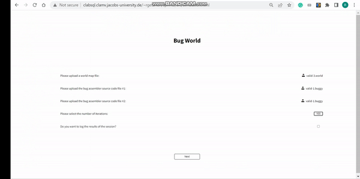
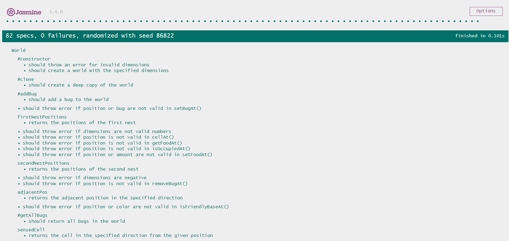
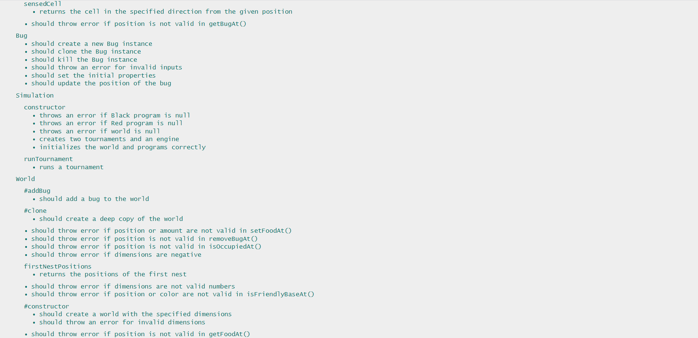
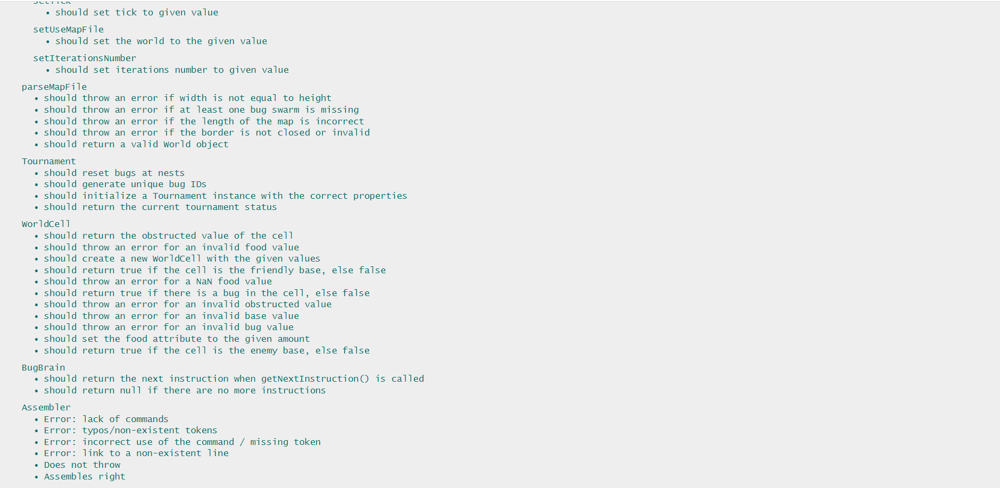

# Pair17_Sprint3

**BugWorld** is an environment of two swarms of bugs, where the goal of the bugs is to collect the most food and bring it back to their base. This is an implementation of the game using HTML, CSS, and Javascript. This project aims to implement an assembler to parse bug instructions, a GUI for the simulator, and the actual simulator itself.

## Libraries / Frameworks / Environments

- [Jasmine](https://jasmine.github.io/)
- [npm](https://nodejs.org/)


## Getting Started

### Prerequisites

Please install [npm](https://nodejs.org/en/download) 

### Installation

---

#### git Clone

```shell
# Clone the repository
## (via HTTPS)
git clone https://github.com/raeygetahun/Bug_World.git

## (via ssh)
git clone git@github.com:raeygetahun/Bug_World.git


# Move to the directory
cd pair17_sprint3/src/
```

Inside `pair17_sprint3/src/`, open `start.html` in your browser.

#### clabsql

You can directly access the website [here](http://clabsql.clamv.jacobs-university.de/~rgetahun/sprint3/). (Note: you need to use Constructor VPN, or be on university premises)

### Usage

---

Valid files to upload are in `pair17_sprint3/input_files/` with the naming scheme `valid-*.world` or `valid-*buggy`. Invalid files have the naming scheme `invalid-*.world` or `invalid-*.buggy`.

To continue to `simulation.html`, all files must be uploaded and the world map must be valid. The same file can be uploaded for both bug files.

In case there are any issues with the uploaded files, an alert will appear. However, if there are no problems, the simulation will commence with the first tournament. 
Once the first tournament is completed, an alert will be shown to announce the winner. Then, the second tournament will begin, and the programs for the two different bugs will be exchanged. 
After the second tournament is finished, an alert will be displayed to announce the winner. Finally, the page will be directed to the quit page.




## Testing

  - The tests are located in the `spec` folder.
  - Open the specrunner.html file in a web browser to run the Jasmine tests
  - Jasmine will output the test results in the browser
  `SpecRunner.html` loads the tests and should be launched to execute the tests. For more information, refer to Jasmine's documentation.
  
  
  

  
## Current file Structure

```
pair17_sprint3/
 ┣ input_files/
 ┃ ┃ buggy/
 ┃ ┃ ┣ invalid-1.buggy
 ┃ ┃ ┣ invalid-2.buggy
 ┃ ┃ ┣ invalid-3.buggy
 ┃ ┃ ┣ invalid-4.buggy
 ┃ ┃ ┣ valid-1.buggy
 ┃ ┃ ┣ valid-2.buggy
 ┃ ┃ world/
 ┃ ┃ ┣ invalid-1.world
 ┃ ┃ ┣ invalid-2.world
 ┃ ┃ ┣ invalid-3.world
 ┃ ┃ ┣ invalid-4.world
 ┃ ┃ ┣ valid-1.world
 ┃ ┃ ┣ valid-2.world
 ┃ ┃ ┣ valid-3.world
 ┃ ┃ ┗ valid-4.world
 ┣ resources
 ┃ ┣ Bug.svg
 ┃ ┣ GreenBug.svg
 ┃ ┗ RedBug.svg
 ┣ scripts/
 ┃ ┣ bug_assembler/
 ┃ ┃ ┣ instructions/
 ┃ ┃ ┃ ┣ Drop.js
 ┃ ┃ ┃ ┣ Flip.js
 ┃ ┃ ┃ ┣ Instruction.js
 ┃ ┃ ┃ ┣ Mark.js
 ┃ ┃ ┃ ┣ Move.js
 ┃ ┃ ┃ ┣ PickUp.js
 ┃ ┃ ┃ ┣ Sense.js
 ┃ ┃ ┃ ┣ Turn.js
 ┃ ┃ ┃ ┗ Unmark.js
 ┃ ┃ ┣ Assembler.js
 ┃ ┃ ┣ CellDirection.js
 ┃ ┃ ┣ Condition.js
 ┃ ┃ ┣ Direction.js
 ┃ ┣ game_logic/
 ┃ ┃ ┣ Bug.js
 ┃ ┃ ┣ BugBrain.js
 ┃ ┃ ┣ BugCondition.js
 ┃ ┃ ┣ Color.js
 ┃ ┃ ┣ Position.js
 ┃ ┃ ┣ World.js
 ┃ ┃ ┗ WorldCell.js
 ┃ ┣ simulator/
 ┃ ┃ ┣ Engine.js
 ┃ ┃ ┣ GUI.js
 ┃ ┃ ┣ Logger.js
 ┃ ┃ ┣ Simulator.js
 ┃ ┃ ┣ Tournament.js
 ┃ ┃ ┣ updategamestat.js
 ┃ ┃ ┗ updategrid.js
 ┃ ┣ CreateWorldMap.js
 ┃ ┣ Files.js
 ┃ ┣ PageSwitch.js
 ┃ ┣ ParseWorldMap.js
 ┃ ┗ simulation.js
 ┣ spec/
 ┃ ┣ Assembler.js
 ┃ ┣ Bug.js
 ┃ ┣ Bugbrain.js
 ┃ ┣ ParseWorldMap.test.js
 ┃ ┣ Position.js
 ┃ ┣ Position.tets.js
 ┃ ┣ Simulator.js
 ┃ ┣ Tournament.js
 ┃ ┣ World.test.js
 ┃ ┣ WorldCell.js
 ┃ ┣ WorldCell.test.js
 ┃ ┣ gui.js
 ┃ ┣ world.js
 ┣ src/
 ┃ ┣ end.html
 ┃ ┣ simulation.html
 ┃ ┗ start.html
 ┣ styles/
 ┃ ┣ simulation.css
 ┃ ┗ style.css
 ┃ .babelrc
 ┃ .gitignore
 ┃ SpecRunner.html
 ┣ README.md
 ┣ package-lock.json
 ┣ package.json
 ┗ favicon.ico
```

## Sprint 1 Progress

1. Created functional welcome page
2. Created functional end of game page
3. Created settings page, homepage, change settings page, and a functional quit game page
4. Created enumerations:

- `CellDirection`
- `Direction`
- `Condition`
- `Color`
- `BugCondition`

5. Implemented `Position` class:
   - Constructor
6. Implemented `WorldCell` class:

   - Constructor
   - `isObstructed()`
   - `isOccupied()`
   - `isFriendlyBase(color)`
   - `isEnemyBase(color)`
   - `isFriendlyMarker(color, position)`
   - `isEnemyMarker(color, position)`
   - `cellMatches(position, bugCondition, color)`
   - `setFood(amt)`
   - `setBug(bug)`
   - `clearMarker(color, position)`
   - `setMarker(color, position)`
   - `getBug(bug)`
   - `getFood()`
   - `removeBug()`
   - `toString()`

7. Partially implemented `World` class:
   - Constructor
   - `isObstructedAt(pos)`
   - `setFoodAt(pos, amt)`
   - `setBugAt(pos, bug)`
   - `cellAt(pos)`
   - `getFoodAt(pos)`
   - `getBugAt(pos)`
   - `removeBugAt(pos)`
8. Partially implemented `Bug` class:
   - Constructor
   - `getPosition()`
   - `toString()`
9. Created `Assembler` class with a stub `assemble(file)` function
10. Implemented `BugBrain` class
    - Constructor
    - `getNextInstruction`
11. Partially implemented `GUI` class
    - Constructor
    - `setIterationsNumber(num)`
    - `setOptions(bool)`
    - `getIterationsNumber()`
12. Implemented `Simulator` classes constructor
13. Implemented file upload and ability to file parse (all on client-side)
14. Partially implemented parsing of world map file (`.world` file)

    - Checks for closed border
    - Checks that both swarms are present
    - Checks for valid characters
    - Checks for valid dimensions
    - Checks for valid map file length that corresponds to given dimensions

15. Implemented creation of map on the web page using a `World` object created after parsing the world map file (each cell is uniquely colored based on the cell type)
16. Documentation / Comments for each function implemented
17. Added test cases for:
    - `parseMapFile(mapFile)` (location: `pair17_sprint1/scripts/ParseWorldMap.js`)
    - Methods in `WorldCell.js` (location: `pair17_sprint1/scripts/game_logic/WorldCell.js`)
    - Methods in`Bug.js` (location: `pair17_sprint1/scripts/game_logic/Bug.js`)
    - Methods in `Position.js` (location: `pair17_sprint1/scripts/game_logic/Position.js`)
18. Added type checking for various methods in:
    - `World.js`
    - `WorldCell.js`
    - `Position.js`
    - `Bug.js`
    - `BugBrain.js`
19. Created files for all classes in UML diagram.


## Sprint 2 Progress

1. implemented `World` class
- `isOccupied`
- `isFriendlyBaseAt`
- `isEnemyBaseAt`
- `setMarkerAt`
- `clearMarkerAt`
- `isFriendlyMarkerAt`
- `isEnemyMarkerAt`
- `toString`
- `adjacent`
- `turn`
- `sensedCell`
2. Fixed some compilation errors and inaccuracies in the implementation of the previous sprint 
(for example, the lack of the required import, using a non-existing variable, wrong type check)
3. Finished implementation of `Bug` class
4. Implemented `Engine` class constructor
5. Implemented `Assembler` class:
- `assemble(file)` that parses file and returns the finite automata
6. Implemented all `instructions` classes for assembler with `execute()`:
- `Instruction.js`
- `Flip.js`
- `Drop.js`
- `Mark.js`
- `Move.js`
- `PickUp.js`
- `Sense.js`
- `Turn.js`
- `Unmark.js`
7. Documentation / Comments for each function implemented as well as parameter checks
8. Added many test cases for:
- `Assembler`
- `World`
9. Added bug images in `resources` folder
(you can change color of bugs in any svg editor to get images with different colored bugs)
10. Improved existing `CreateWorldMap` function:
- To draw hexagonal map and not rectangular
- To write the amount of food in each food cell
- To draw bugs oriented in the right direction
(you need to uncomment temporal code in `CreateWorldMap` that creates bugs in base cells to check this feature)
11. Added website icon

## Sprint 3 Progress
1. Fully and correctly implemented `World` class
    - `clone()`: creates a deep copy of the `World`
    - `addBug(bug)`
    - `tryMoveBug(bug)`
    - `firstNestPositions()`
    - `secondNestPositions()`
    - `adjacentPos(pos, direction)`
    - `getTotalBug(color)`
    - `getUndetectedFood()`
    - `getFoodBroughttoNest(color)`
    - `getTotalFood()`
    - `setTotalfood()`
    - `cellAt(pos)`: corrected the indexing 
    - `adjacent(pos, direction)`: corrected incorrect conditions and logics

2. Fully implemented `WorldCell` class:

   - `clone()`: creates a deep copy of the `WorldCell`
   - `hasfood()`:
   - `matches(condition,color)`:
3. Fully and correctly implemented `BugBrain` class:
   - `getNextInstruction()`:
   
4. Fully implemented `Bug` class:
   - `constructor(options)`: added new properties that are needed to function
   - `clone() `: creates a deep copy of the `Bug`
   - `isDead()`:
   - `executeNextInstruction(instruction)`: corrected it as needed to function
   - `sense(instruction)`:
   - `flip(instruction)`:
   - `mark(instruction`:
   - `unmark(instruction)`:
   - `pickUp(instruction)`:
   - `drop(instruction`:
   - `turn(instruction)`:
   - `move(instruction)`:
   - `turnedBy(turndir)`:
   
5. Fully implemented `GUI` class:
   - `constructor(activatingLogOutput, iterations)`: Added properties as needed
   - `updateMap() `:
   - `updateStat(stat)`:
   - `setUseMapFile(world)`:
   - `setTick(tick)`:
   - `pause()`:
   - `resume()`:

   
6. Fully implemented `SimulationSettings` class:
   - `setWorld(world)`:
   - `setProgram1(Program1)`:
   - `setProgram2(Program2)`:
   - `reset()`:
   
7. Fully implemented `Simulation` class:
   - `constructor(simulationSettings)`:
   - `runTournament()`:
   
8. fully implemented `Tournament` class:
   - `constructor(world,program1,program2)`:
   - `run(iteration,ticksPerSecond)`:
   - `executeNextInstructionForAllBugs(iteration,ticksPerSecond)`:
   - `resetBugsAtNests()`:
   - `genBugId()`:
   - `getCurrentTournamentStatus()`:
   
9. implemented `Drop` class:
    - `execute(bug)`:  
    
10. implemented `Flip` class:
    - `execute(bug)`:
       
11. implemented `Mark` class:
    - `execute(bug)`:
       
12. implemented `Move` class:
    - `execute(bug)`:
       
13. implemented `PickUp` class:
    - `execute(bug)`:
       
14. implemented `Turn` class:
    - `execute(bug)`:
       
15. implemented `Unmark` class:
    - `execute(bug)`:
           
16. fully implemented `GUI` class:
    - `execute(bug)`:
           
17. implemented `Unmark` class:
    - `execute(bug)`:

18. Implemented `updategamestat.js` file:
    - `updateStatistics(statusArray)`: update the DOM to dislay updated statistics about the tournament
    
19. Implemented `updategrid.js` file:
    - `updateGridContents(world)`: update the DOM to dislay updated world map
   
20. Added test cases using Jasmine for:
    - `Assembler.js` (location: `pair17_sprint3/spec/Assembler.js`)
    - Methods in `WorldCell.js` (location: `pair17_sprint3/spec/WorldCell.js`)
    - Methods in `World.js` (location: `pair17_sprint3/spec/World.js`)
    - Methods in`Bug.js` (location: `pair17_sprint3/spec/Bug.js`)
    - Methods in `Position.js` (location: `pair17_sprint3/spec/Position.js`)
    - Methods in `gui.js` (location: `pair17_sprint3/spec/gui.js`)
    - Methods in `Simulator.js` (location: `pair17_sprint3/spec/Simulator.js`)
    - Methods in `Tournament.js` (location: `pair17_sprint3/spec/Tournament.js`)
    - Methods in `ParseWorldMap.js` (location: `pair17_sprint3/spec/ParseWorldMap.js`)
   
21. Update CreareWorldMap.js to only display skeleton of the map 
   
22. Update Files.js to resolve the parsed files 
   
23. In `ParseWorldMap.js` applied trim() function to each line in the mapFile array to removing any leading or trailing whitespace

24. Checked if the map is square or not in `ParseWorldMap.js`
   
25. Stored Parsedfiles and set them to simulator 

26. Implemented a way to run two separate Tournaments Sequentially  

27. Implemented `printResult(result,No)` that displays the winner for each tournament as an alert

28.  Changed the page from simulation to quit after result displays for the second tournament

29. Implemented a way to read new number of iteration and tick per second from option page and set it to gui

30. Implemented a way to pause the simulation when option or quit button are clicked and resume when it is back


   

    
   

